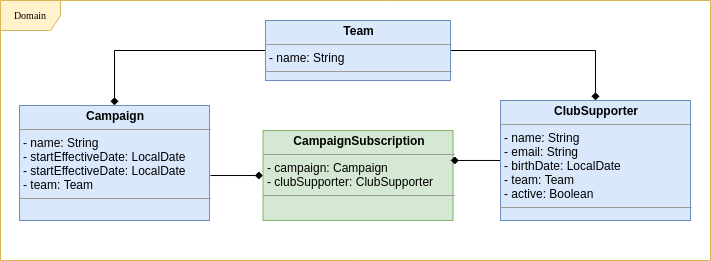

## campaign-service

Serviço responsável pela gestão das campanhas

####Tecnologias Utilizadas 

Segue abaixo as principais tecnologias utilizadas nesse projeto:

* Java 11
* SpringBoot (Web, Data e AMQP)
* JUnit5 e Mockito
* Lombok
* Swagger2
* RabbitMQ (Container)
* PostgreSQL (Container)

#### Pré-requisitos antes de executar a aplicação 

Subir o container do RabbitMQ e outro com o postgresql, ambos os containers estão
configurados no arquivo `docker-compose.yml` para subir os container execute o comando
abaixo:  

`docker-compose up`

Nosso container do rabbitMQ estará acessível no endereço `http://localhost:15672/` através das credenciais 
user:`guest` e password:`guest` é possível acessar o painel admin. 

O container do banco de dados `postgresql` estará rodando no endereço `http://localhost:5438/` através das credenciais
que podem serem visualizadas no arquivo de configuração do projeto `application.yml`.

#### Executar a aplicação 

Para rodar a aplicação execute:

`./gradlew bootRun` 

Ao rodar a aplicação pela primeira vez:

Será criada a fila `campaign-queue`, essa fila foi criada com a finalidade de disponibilizar
para que outros serviços possam ter acesso as campanhas que sofreram atualizações.

A base de dados será criada e populada após a execução do script definido no arquivo `db/initial_script.sql`,
a estratégia de popular os dados ajuda na elaboração de cenários de testes.

Você pode acessar a documentação da api através do swagger:

`http://localhost:8089/swagger-ui.html`

#### Arquitetura

* A organização das classes e pacotes se aplicam a algumas práticas e conceitos DDD, Campaign e CampaignSubscription isolado em um único
contexto de negócio, assim como team e clubsupporter em um contexto isolado. 
* Domínios externos não conhecem as entidades, o trafégo de 
informações entre serviços ocorre através dos DTO's. 

Segue abaixo o diagrama de domínio da aplicação:

#### Como Testar

Cenário de Teste 1: Cadastrar Campanha